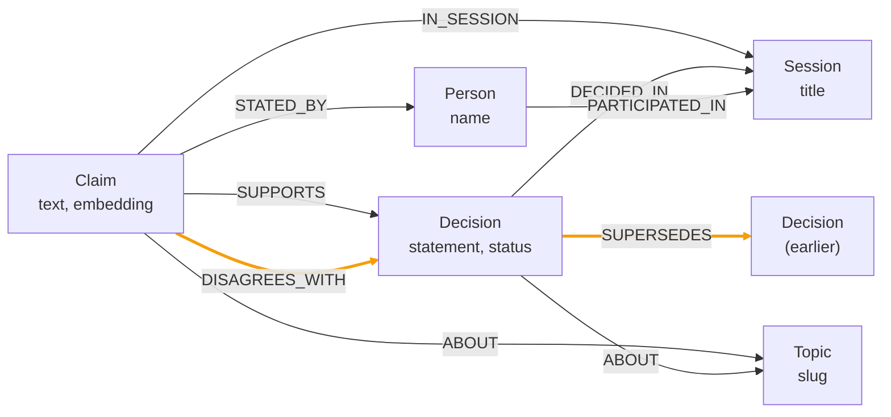

# mnemex

Persistent memory for an AI assistant, stored as a Neo4j knowledge graph instead of a flat chunk index.

## The argument

The standard way to give an assistant memory is retrieval-augmented generation over a vector store. You chop the transcript into chunks, embed them, and pull back nearest neighbours at query time.

That format throws away two things before retrieval ever runs.

**Who said what.** A chunk containing an objection does not record who made it. Attribution is a relationship between a statement and a person. Flattening the text to a vector deletes it.

**Which of two contradictory decisions still stands.** A reversed decision and the decision that reversed it are two similar chunks. Cosine similarity returns both and ranks them by wording, not by recency or by status. Nothing in the index says one overruled the other.

Both of those are edges. You cannot recover an edge from a bag of chunks by tuning top-k.

mnemex writes conversations into a graph where claims, people, decisions, topics, and sessions are nodes, and attribution, stance, and supersession are edges. Recall is hybrid. A vector index finds where in the graph to start. A fixed, handwritten Cypher traversal from that seed collects what actually answers the question. It ships as an MCP server, so any MCP-capable assistant gets this by adding one entry to its config.

## The benchmark query

The fixture is a five-turn conversation across two sessions. Three engineers pick Postgres over one person's objection. In a later session they reverse it.

Run `npm run demo`. This is real output from this repo, with terminal colours stripped:

```text
1. WHAT IS IN THE GRAPH
------------------------------------------------------------------------
  people 3   claims 5   decisions 2   dissent edges 1   supersessions 1

2. THE QUESTION FLAT VECTOR SEARCH CANNOT ANSWER
------------------------------------------------------------------------
  "what did we decide about the storage engine, and who disagreed?"

3. WHAT MNEMEX RETURNS
------------------------------------------------------------------------

  [CURRENT] Move the primary datastore to Neo4j
      overrules: Use Postgres as the primary datastore
      Marcus supported: The traversal queries are now eight joins deep and the latency is unacceptable.
      Priya supported: The join depth argument is convincing, I withdraw my earlier position.

  [SUPERSEDED] Use Postgres as the primary datastore
      overruled by: Move the primary datastore to Neo4j
      Priya supported: Postgres gives us transactional guarantees we already understand.
      Dana supported: Operationally Postgres is the thing we can actually run on call.
      Marcus objected: Our access pattern is almost entirely graph traversal, and Postgres will make that painful.

4. DECISION HISTORY FOR THE TOPIC
------------------------------------------------------------------------
  2026-09-12T06:03:51  [SUPERSEDED] Use Postgres as the primary datastore
      dissent from: Marcus
  2026-09-12T06:04:13  [CURRENT] Move the primary datastore to Neo4j
      replaced: Use Postgres as the primary datastore

5. HONESTY CHECK
------------------------------------------------------------------------
  recall latency      2938 ms
  degraded subsystems none
  A flat vector store would return the text of these claims with no
  speaker attached, and no way to tell which decision still stands.
```

Three things in that output are not available to a chunk index. Marcus is named as the person who objected, and his actual argument is attached. The Postgres decision is marked superseded rather than returned as an equally plausible answer. The Neo4j decision carries the link to what it overruled.

Note the honesty check. That run had `NOSANA_ENDPOINT` set, so the question was embedded on the remote GPU and `degraded` is empty. With the endpoint unset the same run reports `embeddings:local` instead of hiding the substitution. The 2938 ms is one cold `tsx` process: it includes module load, the first Aura connection, and the round trip to Nosana. It is not a steady-state number, and no number in this README is a p50 under load.

## Graph schema

Five node labels.

| Label | Purpose | Key properties |
|---|---|---|
| `Session` | One conversation | `id`, `title`, `startedAt` |
| `Person` | A participant | `id`, `name` |
| `Topic` | Subject matter | `id`, `name`, `slug` |
| `Decision` | An outcome reached | `id`, `statement`, `status`, `decidedAt`, `embedding` |
| `Claim` | One atomic thing said | `id`, `text`, `saidAt`, `embedding` |

`Decision.status` is `current`, `superseded`, or `open`. Every node also carries `testRun` when the writer supplied one, which is how the seed script and the golden test delete their own data without touching anything else.



Two of those edges are the whole point.

`DISAGREES_WITH` carries stance. A chunk index stores the objection text and the decision text as two vectors in the same space. Dissent and agreement are semantically close, because they are about the same subject in the same vocabulary. The index has no field that separates them. Here it is the edge type, and `type(r)` comes back with the row.

`SUPERSEDES` carries decision history. A chunk index has one timestamp per chunk, which tells you when something was written and nothing about whether it is still true. A decision reversed six sessions ago and the decision that reversed it are both real text, both indexed, both retrievable. Here the reversal is an edge written at the moment it happens, and `Decision.status` flips to `superseded` in the same statement. Recall sorts current decisions first because that is what the caller asked for.

Both vector indexes are 768 dimensions with cosine similarity, matching `BAAI/bge-base-en-v1.5` on both the Nosana path and the local fallback. The dimension is read from `EMBEDDING_DIMENSIONS` when `npm run bootstrap` builds the indexes, but changing it later requires dropping and rebuilding them.

## Quickstart

Prerequisites:

- Node 20 or newer. Developed on Node 24. The chat UI in `agent-ui/` declares `engines.node >= 22.19.0`; nothing else in the repo pins a version.
- A Neo4j Aura instance, or any Neo4j 5 with vector index support. `analyze` additionally needs the HTTP Query API on port 443 at the same host, which Aura provides.
- A Daytona API key. The merge planner runs there on write, and `analyze` runs there on read.
- Optionally a Nosana API key and a deployed embedding endpoint. `npm run deploy:nosana` creates one and prints the URL to paste into `NOSANA_ENDPOINT`. Without an endpoint, embeddings fall back to a local model and every response is flagged `embeddings:local`.
- Optionally a second Nosana deployment for the chat UI. `npm run deploy:chat` creates it and prints the URL to paste into `NOSANA_CHAT_ENDPOINT`. Nothing in `src/` needs it; only the chat frontend does.

```bash
git clone https://github.com/Sizbei/mnemex.git
cd mnemex
npm install
```

Copy the environment template and fill it in. The required variables are validated at startup by a zod schema, so a missing one fails immediately with the variable name rather than later with a confusing error.

```bash
cp .env.example .env
$EDITOR .env
```

Apply constraints and vector indexes. The statements all use `IF NOT EXISTS`, so this is safe to re-run.

```bash
npm run bootstrap
```

```text
applied: CREATE CONSTRAINT person_id IF NOT EXISTS FOR (p:Person) REQUIRE p.id IS UNIQUE
applied: CREATE CONSTRAINT topic_id IF NOT EXISTS FOR (t:Topic) REQUIRE t.id IS UNIQUE
applied: CREATE CONSTRAINT session_id IF NOT EXISTS FOR (s:Session) REQUIRE s.id IS UNIQUE
applied: CREATE CONSTRAINT claim_id IF NOT EXISTS FOR (c:Claim) REQUIRE c.id IS UNIQUE
applied: CREATE CONSTRAINT decision_id IF NOT EXISTS FOR (d:Decision) REQUIRE d.id IS UNIQUE
applied: CREATE INDEX topic_slug IF NOT EXISTS FOR (t:Topic) ON (t.slug)
applied: CREATE VECTOR INDEX claim_embedding IF NOT EXISTS
applied: CREATE VECTOR INDEX decision_embedding IF NOT EXISTS

8 statements applied.
```

Load the fixture conversation. Pass `--reset` to clear a previous seed first. Seeded nodes carry `testRun: 'demo'`, which is how the reset finds them without touching anything else in the graph.

```bash
npm run seed -- --reset
```

```text
cleared previous demo data

Priya (proposes): Postgres gives us transactional guarantees we already understand.  [embeddings:local]
Marcus (disagrees): Our access pattern is almost entirely graph traversal, and Postgres will make that painful.  [embeddings:local]
Dana (supports): Operationally Postgres is the thing we can actually run on call.  [embeddings:local]
Marcus (proposes): The traversal queries are now eight joins deep and the latency is unacceptable.  [embeddings:local]
Priya (supports): The join depth argument is convincing, I withdraw my earlier position.  [embeddings:local]

Seeded 5 turns across 2 sessions.
```

That run had no `NOSANA_ENDPOINT`, so each line carries the degraded flag for the write. With the endpoint set the suffix is absent.

Then run the benchmark query.

```bash
npm run demo
```

### Scripts

Every script in `package.json`:

| Command | What it does |
|---|---|
| `npm run build` | `tsc`. Compiles `src/` and `scripts/` to `dist/`. The MCP entry lands at `dist/src/server.js`. |
| `npm run dev` | Runs the MCP server from source over stdio with `tsx`. |
| `npm test` | `vitest run`. Both suites. |
| `npm run coverage` | `vitest run --coverage`, v8 provider. |
| `npm run bootstrap` | Applies the constraints and vector indexes above. |
| `npm run seed` | Writes the five-turn fixture through the real `remember` path. `-- --reset` clears the previous seed. |
| `npm run demo` | The read-only benchmark script. |
| `npm run deploy:nosana` | Creates and starts the embedding deployment, then prints the `NOSANA_ENDPOINT` line. |
| `npm run deploy:chat` | Creates and starts the instruct-model deployment, then prints the `NOSANA_CHAT_ENDPOINT` line. |

`scripts/generate-agent-ui.ts` has no npm entry, because it needs an AgentCanvas checkout. See [The chat UI](#the-chat-ui).

### Web UI

The web app is a Next.js page that asks the same question through the same code path. It imports the compiled `dist/` build directly rather than reimplementing recall, so build the root package first.

```bash
npm run build
ln -s ../.env web/.env
cd web && npm install && npm run dev
```

The symlink is needed because the Next.js process loads `.env` relative to its own working directory, and `web/.env` is gitignored, so a fresh clone has to recreate it.

Open `http://localhost:3000`. There are four tabs.

| Tab | What it shows |
|---|---|
| Answer | The recalled decisions, current first, with dissent split out from support. |
| Memory graph | Every node and edge in a d3 force layout, with an inspector for the selected node and everything one hop away. Superseded decisions go grey and `DISAGREES_WITH` edges are amber. |
| History | The topic timeline, from the `timeline` tool. |
| Write | A form that writes a real speaker turn into memory, next to the live graph. |

The Write tab posts to `/api/remember`, which calls the compiled `remember`. Every write is tagged `testRun: "demo"` by that route, so `npm run seed -- --reset` will clear anything written through the UI. On success the page reloads the graph and re-runs the current question, so a new dissent edge or a supersession appears without a manual refresh.

The page uses three routes: `/api/ask` (recall plus timeline), `/api/memory` (all nodes and edges), and `/api/remember`. `analyze` is not exposed to the browser.

### The chat UI

`agent-ui/` is a chat frontend where a model calls the mnemex tools itself. This is what the second Nosana deployment is for: the instruct model there is the assistant, and the graph is its memory.

The React app is generated, not hand-written. It is the standalone project exported by [AgentCanvas](https://github.com/raytone-lab/agentcanvas), produced by `scripts/generate-agent-ui.ts` against a local AgentCanvas checkout:

```bash
AGENTCANVAS_DIR=/path/to/agentcanvas npx tsx scripts/generate-agent-ui.ts
```

Every file that script writes is listed in `agent-ui/.generated.json`, and a later run overwrites exactly those. Everything else is left alone, which is why the hand-written part lives under `agent-ui/server/`.

The backend runs as its own process from the repository root, because it imports the compiled tools out of `dist/` and reads the root `.env`.

```bash
npm run build
node --import tsx agent-ui/server/index.ts
```

In a second terminal:

```bash
cd agent-ui && npm install && npm run dev
```

What the backend does on `POST /__agentcanvas/pi/prompt`, streaming newline-delimited AgentUX events the whole time:

1. Sends the conversation plus three tool definitions to the OpenAI-compatible endpoint at `NOSANA_CHAT_ENDPOINT`.
2. When the model answers with `tool_calls`, runs the real `remember`, `recall`, or `timeline` against Neo4j, streams the call and its result to the UI, appends a compacted copy to the transcript, and asks the model again.
3. Repeats up to five rounds. The last round goes out with no tools attached, so the model has to produce prose rather than loop.

The tool definitions are derived from the zod schemas in `src/tools/` with `z.toJSONSchema`, so they cannot drift from what the functions accept. Two deliberate omissions: `remember`'s `testRun` field is stripped, because a model that set it would quietly mark real memories as disposable, and `analyze` is not offered at all. The model gets a trimmed copy of each tool result, capped at 3000 characters with individual claim text cut at 240, because the deployment's context window is 16k and a full recall answer can fill a large part of it.

The server binds `127.0.0.1` only, on `MNEMEX_UI_PORT` (default 8787). If `NOSANA_CHAT_ENDPOINT` is unset the app still loads and says so in the first message rather than hanging.

## Configuration

`src/config.ts` parses `process.env` with a zod schema and throws on the first problem, naming every offending variable. Everything in this table is read there, and everything in `src/`, `scripts/`, and `web/` gets its settings from it.

| Variable | Required | Default | Purpose |
|---|---|---|---|
| `NEO4J_URI` | yes | — | Bolt URI of the instance. `analyze` also takes the hostname from it to build the Query API URL and the sandbox egress allow list. |
| `NEO4J_USERNAME` | yes | — | Graph credentials. |
| `NEO4J_PASSWORD` | yes | — | Graph credentials. |
| `NEO4J_DATABASE` | yes | — | Database every session opens against, and the database segment of the Query API path. |
| `NOSANA_API_KEY` | yes | — | Bearer token for the deployment API. Only the two deploy scripts use it. |
| `NOSANA_API_URL` | yes, must parse as a URL | — | Deployment API base, `https://api.nosana.com/api`. |
| `NOSANA_MARKET` | yes | — | Market the **embedding** deployment is created on. The chat deployment does not use it. |
| `NOSANA_ENDPOINT` | no | unset | Base URL of the embedding deployment. `/v1/embeddings` is appended. Empty or unset means every embedding call goes to the local model. |
| `DAYTONA_API_KEY` | yes | — | Sandbox credentials, used by the merge planner and by `analyze`. |
| `DAYTONA_API_URL` | yes, must parse as a URL | — | Sandbox API base, `https://app.daytona.io/api`. |
| `EMBEDDING_DIMENSIONS` | no | `768` | Dimension both vector indexes are created with. |
| `REMOTE_TIMEOUT_MS` | no | `3000` | Abort signal on the Nosana embeddings call. |
| `DAYTONA_TIMEOUT_MS` | no | `15000` | Budget for the merge-planner sandbox, create and run. |
| `ANALYZE_TIMEOUT_MS` | no | `30000` | Budget for the `analyze` sandbox. Longer than the write path because `analyze` has no fallback to degrade to, and because the egress allow list adds proxy setup to sandbox creation. |

Four more variables are read directly from `process.env` by the chat backend in `agent-ui/server/env.ts`. They are not in the zod schema, and the MCP server neither reads nor requires them.

| Variable | Default | Purpose |
|---|---|---|
| `NOSANA_CHAT_ENDPOINT` | unset | The instruct model's OpenAI-compatible base URL. Either form works: `/v1/chat/completions` is appended, or just `/chat/completions` if the value already ends in `/v1`. Unset means the chat UI reports that it has no model. |
| `NOSANA_CHAT_MODEL` | `chat` | Model id sent in each request. Matches `--served-model-name` in the deploy script. |
| `MNEMEX_UI_PORT` | `8787` | Loopback port the chat backend listens on. |
| `MNEMEX_CHAT_CONNECT_TIMEOUT_MS` | `30000` | Guards the handshake only. The response stream itself is unbounded, because a tool loop is legitimately slow. |

`.env.example` covers the zod-validated set. `NOSANA_CHAT_ENDPOINT` is not in it; `npm run deploy:chat` prints the line to add.

## MCP configuration

Build first. The server entry compiles to `dist/src/server.js`.

```bash
npm run build
```

Pass the environment inline when you register the server. `src/config.ts` calls dotenv with no path, so `.env` is resolved against the **server process's** working directory, and an MCP client launches the server from wherever the client happens to be. If that is not the repository root, the file is never found and the server dies at startup with `Invalid or missing environment variables`. Inline variables remove the dependency on cwd entirely.

```bash
set -a && . ./.env && set +a
claude mcp add mnemex \
  -e NEO4J_URI="$NEO4J_URI" \
  -e NEO4J_USERNAME="$NEO4J_USERNAME" \
  -e NEO4J_PASSWORD="$NEO4J_PASSWORD" \
  -e NEO4J_DATABASE="$NEO4J_DATABASE" \
  -e NOSANA_API_KEY="$NOSANA_API_KEY" \
  -e NOSANA_API_URL="$NOSANA_API_URL" \
  -e NOSANA_MARKET="$NOSANA_MARKET" \
  -e NOSANA_ENDPOINT="$NOSANA_ENDPOINT" \
  -e DAYTONA_API_KEY="$DAYTONA_API_KEY" \
  -e DAYTONA_API_URL="$DAYTONA_API_URL" \
  -- node "$(pwd)/dist/src/server.js"
```

For a client configured by JSON rather than by CLI, the same values go in that entry's `env` object.

Register the official Neo4j MCP server against the same instance. This is deliberate separation. mnemex owns the typed memory operations. The Neo4j server gives raw Cypher for inspection and debugging, so nobody has to take mnemex's word for what is in the graph.

```bash
claude mcp add neo4j -- uvx mcp-neo4j-cypher@latest \
  --db-url "$NEO4J_URI" --username "$NEO4J_USERNAME" --password "$NEO4J_PASSWORD" --database "$NEO4J_DATABASE"
claude mcp list
```

Note the path is `dist/src/server.js`, not `dist/server.js`, and the server runs compiled output, so re-run `npm run build` after changing anything under `src/`.

### Tools

Four tools are registered in `src/server.ts`. Input shapes below are the zod schemas in `src/tools/`.

**`remember`** writes one speaker turn.

```ts
{
  sessionId: string                 // required, non-empty
  sessionTitle?: string             // defaults to sessionId
  speaker: string                   // required, non-empty
  claims: string[]                  // required, at least one non-empty string
  topic?: string                    // slugified into a Topic node id
  decision?: {
    statement: string
    stance: "supports" | "disagrees" | "proposes"
  }
  testRun?: string                  // tags created nodes so a test or demo can delete its own data
}
```

Returns `{ personId, sessionId, claimIds, decisionId, merged: { claims, person }, degraded }`.

**`recall`** is the primary read.

```ts
{
  question: string                  // required, non-empty
  topK?: number                     // integer, 1 to 50, default 8
}
```

Returns `{ decisions, degraded }`, where each decision is `{ id, statement, status, positions, supersedes, supersededBy }` and each position is `{ person, stance, claim }` with stance `SUPPORTS` or `DISAGREES_WITH`. `supersedes` and `supersededBy` are arrays of decision **statements**, not ids, so a caller can print them without a second lookup. Current decisions sort first.

**`timeline`** returns a topic's decision history.

```ts
{ topic: string }                   // required, non-empty; matched on slug
```

Returns `{ topic, entries, degraded }`, where each entry is `{ statement, status, decidedAt, supersedes, dissenters }` ordered by `decidedAt` ascending.

**`analyze`** runs read-only Cypher for the questions the other three do not cover: counting, grouping, or traversing relationships they do not expose.

```ts
{
  cypher: string                    // required, non-empty
  params?: Record<string, unknown>  // default {}
}
```

Returns `{ rows, degraded }`, where `rows` is the Query API's result mapped into one object per row keyed by the returned field names.

This is the one tool that executes text the model wrote, so it is guarded three times over.

**A static guard runs first.** `containsWrite` rejects any query matching `create|merge|delete|set|remove|drop|detach|foreach|load csv|call apoc.periodic` on a word boundary, and throws before a sandbox is spent. The word boundary is what keeps a property named `createdAt` out of the net. This is an approximation and is treated as one.

**The real guarantee is server-side.** The sandbox program sends `accessMode: "READ"` with every statement, and Neo4j answers a write with `Neo.ClientError.Statement.AccessMode` no matter what the regex missed. A query Neo4j rejects, for that reason or for a syntax error, is reported back as `Neo4j refused the query: <message>` rather than being blamed on the sandbox.

**The query runs in a Daytona sandbox with a one-host egress allow list.** `domainAllowList` names only the Aura hostname derived from `NEO4J_URI`, so nothing else is reachable from inside. The sandbox program (`sandbox/query.ts`) speaks HTTPS to the Neo4j Query API at `https://<host>/db/<database>/query/v2`, not Bolt: only ports 80 and 443 egress a Daytona sandbox, so 7687 is unreachable and the driver could not connect from there even if it were installed.

If the sandbox cannot be created or the run fails, `analyze` returns `{ rows: [], degraded: ["analyze:disabled"] }`. It does **not** fall back to running the query in this process. The write path degrades to an in-process normalizer because that code is the project's own; this code is not, so disabled is the only correct degraded state.

`analyze` is offered over MCP only. Neither the web UI nor the chat UI exposes it.

## Platforms and degradation

Every tool response carries a `degraded` array. An empty array means every subsystem ran on its primary path. The array is how the assistant, and the demo, can tell the difference without guessing.

**Neo4j Aura** is the system of record. Nodes, edges, and both vector indexes live there. The MCP server owns every transaction, and nothing else writes to the graph.

There is no fallback, on purpose. If Neo4j is unreachable the tool call throws and the assistant sees the error. Silently accepting a write that goes nowhere is worse than failing, because the assistant would report a memory saved and the user would find out several sessions later that it never existed.

**Nosana** runs two separate deployments. Keep them distinct: they serve different models on different markets for different parts of the system.

| | Embeddings | Chat |
|---|---|---|
| Script | `npm run deploy:nosana` | `npm run deploy:chat` |
| Deployment name | `mnemex-embeddings` | `mnemex-chat` |
| Model | `BAAI/bge-base-en-v1.5` | `Qwen/Qwen2.5-7B-Instruct` |
| Image | `vllm/vllm-openai:v0.10.2` | `vllm/vllm-openai:v0.10.2` |
| Market | `NOSANA_MARKET`, an 8 GB 3070 | `nvidia-a6000`, 48 GB, id hardcoded in the script |
| Served name | `embed` | `chat` |
| Route used | `/v1/embeddings` | `/v1/chat/completions` |
| Read from | `NOSANA_ENDPOINT` | `NOSANA_CHAT_ENDPOINT` |
| Consumed by | `src/embedding/nosana.ts`, on every write and every recall | the chat backend in `agent-ui/server/` |

The embedding deployment is on the hot path. Every write embeds its claims and decision statement; every recall embeds the question. Calls carry a `REMOTE_TIMEOUT_MS` abort signal, defaulting to 3000 ms. The model is served with `--task embed`, which exposes the OpenAI-compatible embeddings route and preserves bge's own CLS-and-normalize pooler.

If the endpoint is unset, errors, or exceeds the timeout, the server falls back to the same checkpoint running locally through fastembed and appends `embeddings:local` to `degraded`. Both sides are 768-dimensional and L2-normalized, so vectors written on one path are comparable with vectors read on the other. This is why the local provider calls `embed` and never `passageEmbed` or `queryEmbed`: those prepend E5-style prefixes that would put the fallback in a different vector space from Nosana. It is also why the local model is pinned to `BGEBaseENV15` rather than `BGEBaseEN`, which is a different checkpoint at the same dimension. A 3000 ms budget is tight enough that a single call does occasionally trip it and land on the local model mid-run; that is visible in `degraded`, and the vectors stay comparable either way.

The chat deployment exists so an assistant can be the thing calling the tools rather than a client on your laptop. It is started with `--enable-auto-tool-choice` and `--tool-call-parser hermes`, because Qwen2.5 ships a Hermes-style tool-use chat template and because vLLM ignores the `tools` array entirely without that first flag. `--max-model-len 16384` and `--gpu-memory-utilization 0.90` set the window and the KV cache. The market is hardcoded rather than taken from `NOSANA_MARKET`: the 3070 the embedding deployment runs on has 8 GB and cannot hold a 7B model, and per the script's comment the cheaper 24 GB markets all showed zero idle nodes at the time, so the a6000 was chosen as the smallest market with a node actually free.

Both scripts create the deployment with `confidential: false` explicitly, because the API defaults it to true and a confidential deployment created over REST never starts. Both poll, both print the `.env` line to paste, and both stop the deployment if the poll fails, so a failed attempt does not sit there holding reserved credits. `deploy:nosana` polls for forty minutes and waits on `endpoints[].online`; `deploy:chat` polls for forty-five and probes `/v1/models` itself, because `online` stays false on deployments that are demonstrably serving. Neither writes the endpoint anywhere: you paste it into `.env` by hand and restart.

Cost, as recorded in the comments in the deploy scripts rather than measured here: both deployments are created with a ten-hour timeout, which the comments put at roughly $0.73 for the embedding deployment and roughly $4.00 for the chat deployment, both including the 10 percent network fee. The chat script's comment prices the a6000 market at $0.3636/hr. Credits stay reserved until a deployment is stopped.

**Daytona** runs both sandboxed workloads, with different budgets and different failure behaviour.

The merge planner runs there on write. Conversation text is untrusted input, and the planner is the component that decides whether a new claim is a restatement of an existing one and whether a new decision reverses a standing one. It runs in an isolated sandbox and returns a plan. It never touches the database.

The server then validates the plan before executing it. Any plan referencing an id that was not in the candidate set it was handed is rejected with a `PlanValidationError`, and that error is re-thrown rather than swallowed, because a plan reaching outside its inputs is never acceptable on any path. If Daytona is unavailable, the same pure function runs in-process, the result goes through the identical validation, and `normalizer:inprocess` is appended to `degraded`. That path gets `DAYTONA_TIMEOUT_MS`, defaulting to 15000 ms, because sandbox creation is slower than an inference call and the write should degrade quickly rather than stall.

`analyze` runs there on read, under `ANALYZE_TIMEOUT_MS`, defaulting to 30000 ms. It waits longer because it has nowhere to degrade to, and because the egress allow list adds proxy setup to sandbox creation. One measured `analyze` call on this machine, sandbox creation included, took 4.7 seconds.

| Subsystem | On failure | `degraded` value |
|---|---|---|
| Nosana embeddings | Local fastembed model | `embeddings:local` |
| Daytona merge planner | In-process pure function | `normalizer:inprocess` |
| Daytona `analyze` sandbox | Tool disabled, returns no rows | `analyze:disabled` |
| Neo4j | Tool call fails loudly | none, by design |

## Testing

```bash
npm test              # vitest run
npm run coverage      # vitest run --coverage
```

There are two suites, and they have different requirements.

`tests/unit/analyze.test.ts` reaches no live service. It mocks `@daytonaio/sdk` so that creating a sandbox throws, which is the only way to make Daytona unreachable from a test: the SDK uses axios, so stubbing `globalThis.fetch` would not do it. It does still need a populated `.env`, because `analyze` calls `loadConfig` and that validates the whole schema. Fourteen assertions: ten write forms the static guard must reject, two reads it must not fire on including a property named `createdAt`, a write refused before any sandbox is started, and the important one, that an unreachable Daytona produces `degraded: ["analyze:disabled"]` and no rows rather than a query run unsandboxed.

`tests/golden/recall.test.ts` requires a live Neo4j instance. It tags everything it creates with `testRun: 'golden'` and deletes it in both `beforeAll` and `afterAll`, so it does not collide with seeded demo data.

The golden suite is the acceptance gate. It seeds the five-turn fixture through the real `remember` path, then makes four assertions against the real `recall` path:

1. `recall` returns "Move the primary datastore to Neo4j" as current, and does not return the reversed Postgres decision as current.
2. The Postgres decision comes back marked `superseded`.
3. Asking who disagreed names Marcus.
4. The dissent carries Marcus's actual argument, matched against `/graph traversal/i`, not just his name.

Those four assertions are the argument of the project stated as code. Assertion 3 is the one a chunk index cannot satisfy at all. Assertion 1 is the one it satisfies only by accident. If this test is green, the demo works, which is why it was written before any implementation.

Current state on this machine:

```text
 ✓ tests/unit/analyze.test.ts (14 tests) 7ms
 ✓ tests/golden/recall.test.ts (4 tests) 61123ms
 Test Files  2 passed (2)
      Tests  18 passed (18)
```

## Limitations

These are real, not hedges.

**Automatic extraction from raw transcripts is an explicit non-goal.** mnemex does not read a conversation and infer who claimed what. The assistant supplies the structure through the `remember` schema: it names the speaker, the claims, the topic, and the stance. That is a deliberate scope boundary, and it is the single biggest gap between this and a product. An extraction layer would sit in front of `remember` and would need its own accuracy evaluation.

**`analyze`'s first guard is a regex, not a parser.** It is deliberately cheap and deliberately not the security boundary; `accessMode: "READ"` is. But it will refuse a legitimate read that happens to contain one of those words in a string literal or a label name, and there is no escape hatch for that case.

**`analyze` returns rows unshaped.** Whatever the Query API gives back is what the caller gets, including Neo4j's own JSON encoding of temporal and spatial types. Nothing normalizes it the way the other three tools normalize their output.

**Entity resolution is exact name matching.** `planMerge` resolves a speaker by case-insensitive exact match on `Person.name`. There is no alias handling and no fuzzy matching, despite `aliases` appearing on `Person` in the design spec. Two spellings of the same person produce two nodes. That is the conservative direction on purpose, because a false merge means wrong attribution, but it is not resolution.

**Supersession detection fires only on a `proposes` stance.** A reversal expressed as a `supports` turn will not create a `SUPERSEDES` edge. The primary signal is the caller-supplied topic; similarity is only a fallback for turns with no topic, at a 0.7 cosine threshold. The comment in `src/planner/merge.ts` records why: the two fixture decisions measure 0.75 against each other, which is not enough separation to trust similarity alone.

**`timeline` always reports `degraded: []`.** It is a pure graph read with no embedding step, so today that is accurate. It is hardcoded rather than derived, so it will not start telling the truth on its own if the tool grows a remote dependency.

**Test coverage is thin.** `tests/unit/` covers `analyze`'s guard and its degradation, and nothing else. The merge planner, plan validation, schema validation, and the embedding fallback switch have no unit tests, and there are no integration tests with the remote services stubbed. The 80 percent coverage target is not met.

**Both Nosana deployments are a manual step.** Each script creates and starts its deployment and prints the endpoint URL, but writes it nowhere. You copy it into `.env` by hand, and every process that reads it has to restart to pick it up. The chat market id is hardcoded in `scripts/deploy-chat.ts` and will need editing when that market has no idle node.

**Latency is anecdote, not measurement.** The numbers in this README are single cold runs on one machine. There is no benchmark harness, no percentiles, and no measurement under concurrency.

## Repository layout

```text
src/
  server.ts          MCP server entry, four tools registered
  config.ts          env loading, validated by zod at startup
  tools/             remember, recall, timeline, analyze
  graph/             driver, schema DDL, all Cypher as named constants
  embedding/         Nosana provider, local fallback, selection and degraded reporting
  planner/           pure merge-plan function and plan validation
  sandbox/           Daytona client, shared sandbox helpers, fallback delegation
sandbox/
  normalize.ts       the merge planner, as source shipped into a Daytona sandbox
  query.ts           the read-only Query API caller, likewise
scripts/             bootstrap-graph, seed-demo, demo, deploy-nosana, deploy-chat, generate-agent-ui
tests/
  golden/            the acceptance test, against a live Neo4j
  unit/              analyze's guard and its degraded state, no live services
  fixtures/          the five-turn conversation, shared by the golden test and the seed script
web/                 Next.js UI over the compiled dist/ build
agent-ui/            generated AgentCanvas chat client, plus the hand-written mnemex backend in server/
docs/                design spec, implementation plan, demo runbook, slide deck
```

## Documents

- [PRD.md](./PRD.md)
- [Design specification](./docs/superpowers/specs/2026-09-12-graph-memory-design.md)
- [Implementation plan](./docs/superpowers/plans/2026-09-12-mnemex.md)
- [Demo runbook](./docs/demo-runbook.md)
- [Chat UI notes](./agent-ui/README.md)
- [Slide deck](./docs/deck/mnemex.html)
