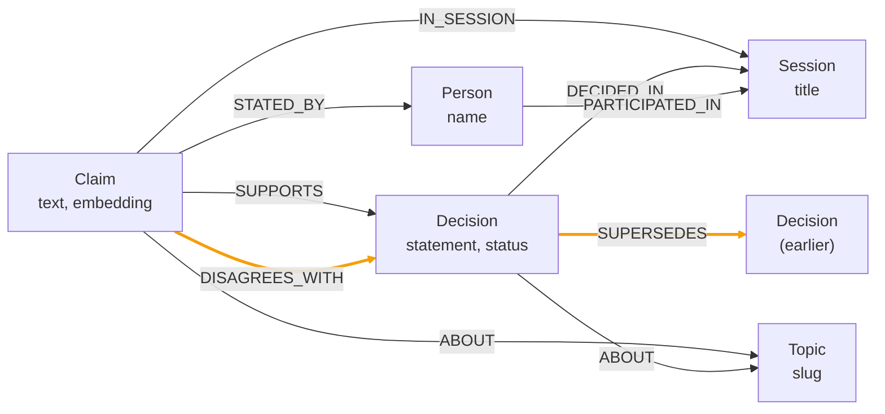

# mnemex

Persistent memory for an AI assistant, stored as a Neo4j knowledge graph instead of a flat chunk index.

## The argument

The standard way to give an assistant memory is retrieval-augmented generation over a vector store. You chop the transcript into chunks, embed them, and pull back nearest neighbours at query time.

That format throws away two things before retrieval ever runs.

**Who said what.** A chunk containing an objection does not record who made it. Attribution is a relationship between a statement and a person. Flattening the text to a vector deletes it.

**Which of two contradictory decisions still stands.** A reversed decision and the decision that reversed it are two similar chunks. Cosine similarity returns both and ranks them by wording, not by recency or by status. Nothing in the index says one overruled the other.

Both of those are edges. You cannot recover an edge from a bag of chunks by tuning top-k.

mnemex writes conversations into a graph where claims, people, decisions, topics, and sessions are nodes, and attribution, stance, and supersession are edges. Recall is hybrid. A vector index finds where in the graph to start. A fixed, handwritten Cypher traversal from that seed collects what actually answers the question. It ships as an MCP server, so any MCP-capable assistant gets this by adding one entry to its config.

## The benchmark query

The fixture is a five-turn conversation across two sessions. Three engineers pick Postgres over one person's objection. In a later session they reverse it.

Run `npm run demo`. This is real output from this repo, with terminal colours stripped:

```text
1. WHAT IS IN THE GRAPH
------------------------------------------------------------------------
  people 3   claims 5   decisions 2   dissent edges 1   supersessions 1

2. THE QUESTION FLAT VECTOR SEARCH CANNOT ANSWER
------------------------------------------------------------------------
  "what did we decide about the storage engine, and who disagreed?"

3. WHAT MNEMEX RETURNS
------------------------------------------------------------------------

  [CURRENT] Move the primary datastore to Neo4j
      overrules: Use Postgres as the primary datastore
      Marcus supported: The traversal queries are now eight joins deep and the latency is unacceptable.
      Priya supported: The join depth argument is convincing, I withdraw my earlier position.

  [SUPERSEDED] Use Postgres as the primary datastore
      overruled by: Move the primary datastore to Neo4j
      Priya supported: Postgres gives us transactional guarantees we already understand.
      Dana supported: Operationally Postgres is the thing we can actually run on call.
      Marcus objected: Our access pattern is almost entirely graph traversal, and Postgres will make that painful.

4. DECISION HISTORY FOR THE TOPIC
------------------------------------------------------------------------
  2026-09-12T06:03:51  [SUPERSEDED] Use Postgres as the primary datastore
      dissent from: Marcus
  2026-09-12T06:04:13  [CURRENT] Move the primary datastore to Neo4j
      replaced: Use Postgres as the primary datastore

5. HONESTY CHECK
------------------------------------------------------------------------
  recall latency      1326 ms
  degraded subsystems embeddings:local
```

Three things in that output are not available to a chunk index. Marcus is named as the person who objected, and his actual argument is attached. The Postgres decision is marked superseded rather than returned as an equally plausible answer. The Neo4j decision carries the link to what it overruled.

Note the honesty check. That run used the local embedding fallback, because `NOSANA_ENDPOINT` was unset in the environment it ran in. The `degraded` array says so instead of hiding it. The 1326 ms includes loading the local ONNX model into a cold process, which the Nosana path does not pay.

## Graph schema

Five node labels.

| Label | Purpose | Key properties |
|---|---|---|
| `Session` | One conversation | `id`, `title`, `startedAt` |
| `Person` | A participant | `id`, `name` |
| `Topic` | Subject matter | `id`, `name`, `slug` |
| `Decision` | An outcome reached | `id`, `statement`, `status`, `decidedAt`, `embedding` |
| `Claim` | One atomic thing said | `id`, `text`, `saidAt`, `embedding` |

`Decision.status` is `current`, `superseded`, or `open`.



Two of those edges are the whole point.

`DISAGREES_WITH` carries stance. A chunk index stores the objection text and the decision text as two vectors in the same space. Dissent and agreement are semantically close, because they are about the same subject in the same vocabulary. The index has no field that separates them. Here it is the edge type, and `type(r)` comes back with the row.

`SUPERSEDES` carries decision history. A chunk index has one timestamp per chunk, which tells you when something was written and nothing about whether it is still true. A decision reversed six sessions ago and the decision that reversed it are both real text, both indexed, both retrievable. Here the reversal is an edge written at the moment it happens, and `Decision.status` flips to `superseded` in the same transaction. Recall sorts current decisions first because that is what the caller asked for.

Both vector indexes are 768 dimensions with cosine similarity, matching `BAAI/bge-base-en-v1.5` on both the Nosana path and the local fallback. The dimension is read from `EMBEDDING_DIMENSIONS`, but changing it requires dropping and rebuilding the indexes.

## Quickstart

Prerequisites:

- Node 20 or newer. Developed on Node 24.
- A Neo4j Aura instance, or any Neo4j 5 with vector index support.
- A Daytona API key. The merge planner runs there on write.
- Optionally a Nosana API key and a deployed embedding endpoint. `npm run deploy:nosana` creates one and prints the URL to paste into `NOSANA_ENDPOINT`. Without an endpoint, embeddings fall back to a local model and every response is flagged `embeddings:local`.

```bash
git clone https://github.com/Sizbei/mnemex.git
cd mnemex
npm install
```

Copy the environment template and fill it in. Every variable in it is validated at startup by a zod schema, so a missing one fails immediately with the variable name rather than later with a confusing error.

```bash
cp .env.example .env
$EDITOR .env
```

Apply constraints and vector indexes. The statements all use `IF NOT EXISTS`, so this is safe to re-run.

```bash
npm run bootstrap
```

```text
applied: CREATE CONSTRAINT person_id IF NOT EXISTS FOR (p:Person) REQUIRE p.id IS UNIQUE
applied: CREATE CONSTRAINT topic_id IF NOT EXISTS FOR (t:Topic) REQUIRE t.id IS UNIQUE
applied: CREATE CONSTRAINT session_id IF NOT EXISTS FOR (s:Session) REQUIRE s.id IS UNIQUE
applied: CREATE CONSTRAINT claim_id IF NOT EXISTS FOR (c:Claim) REQUIRE c.id IS UNIQUE
applied: CREATE CONSTRAINT decision_id IF NOT EXISTS FOR (d:Decision) REQUIRE d.id IS UNIQUE
applied: CREATE INDEX topic_slug IF NOT EXISTS FOR (t:Topic) ON (t.slug)
applied: CREATE VECTOR INDEX claim_embedding IF NOT EXISTS
applied: CREATE VECTOR INDEX decision_embedding IF NOT EXISTS

8 statements applied.
```

Load the fixture conversation. Pass `--reset` to clear a previous seed first. Seeded nodes carry `testRun: 'demo'`, which is how the reset finds them without touching anything else in the graph.

```bash
npm run seed -- --reset
```

```text
cleared previous demo data

Priya (proposes): Postgres gives us transactional guarantees we already understand.  [embeddings:local]
Marcus (disagrees): Our access pattern is almost entirely graph traversal, and Postgres will make that painful.  [embeddings:local]
Dana (supports): Operationally Postgres is the thing we can actually run on call.  [embeddings:local]
Marcus (proposes): The traversal queries are now eight joins deep and the latency is unacceptable.  [embeddings:local]
Priya (supports): The join depth argument is convincing, I withdraw my earlier position.  [embeddings:local]

Seeded 5 turns across 2 sessions.
```

Then run the benchmark query.

```bash
npm run demo
```

### Web UI

The web app is a Next.js page that asks the same question through the same code path. It imports the compiled `dist/` build directly rather than reimplementing recall, so build the root package first.

```bash
npm run build
ln -s ../.env web/.env
cd web && npm install && npm run dev
```

Open `http://localhost:3000`. The Answer tab shows the recalled decisions with dissent split out. The Memory graph tab renders every node and edge with a force layout, where superseded decisions go grey and `DISAGREES_WITH` edges are highlighted. The History tab is the topic timeline.

The symlink is needed because the Next.js process loads `.env` relative to its own working directory, and `web/.env` is gitignored.

## MCP configuration

Build first. The server entry compiles to `dist/src/server.js`.

```bash
npm run build
claude mcp add mnemex -- node "$(pwd)/dist/src/server.js"
```

Register the official Neo4j MCP server against the same instance. This is deliberate separation. mnemex owns the typed memory operations. The Neo4j server gives raw Cypher for inspection and debugging, so nobody has to take mnemex's word for what is in the graph.

```bash
set -a && . ./.env && set +a
claude mcp add neo4j -- uvx mcp-neo4j-cypher@latest \
  --db-url "$NEO4J_URI" --username "$NEO4J_USERNAME" --password "$NEO4J_PASSWORD" --database "$NEO4J_DATABASE"
claude mcp list
```

### Tools

Input shapes below are the zod schemas in `src/tools/`.

**`remember`** writes one speaker turn.

```ts
{
  sessionId: string                 // required, non-empty
  sessionTitle?: string             // defaults to sessionId
  speaker: string                   // required, non-empty
  claims: string[]                  // required, at least one non-empty string
  topic?: string                    // slugified into a Topic node id
  decision?: {
    statement: string
    stance: "supports" | "disagrees" | "proposes"
  }
  testRun?: string                  // tags created nodes so a test or demo can delete its own data
}
```

Returns `{ personId, sessionId, claimIds, decisionId, merged: { claims, person }, degraded }`.

**`recall`** is the primary read.

```ts
{
  question: string                  // required, non-empty
  topK?: number                     // integer, 1 to 50, default 8
}
```

Returns `{ decisions, degraded }`, where each decision is `{ id, statement, status, positions, supersedes, supersededBy }` and each position is `{ person, stance, claim }` with stance `SUPPORTS` or `DISAGREES_WITH`. Current decisions sort first.

**`timeline`** returns a topic's decision history.

```ts
{ topic: string }                   // required, non-empty; matched on slug
```

Returns `{ topic, entries, degraded }`, where each entry is `{ statement, status, decidedAt, supersedes, dissenters }` ordered by `decidedAt` ascending.

## Platforms and degradation

Every tool response carries a `degraded` array. An empty array means every subsystem ran on its primary path. The array is how the assistant, and the demo, can tell the difference without guessing.

**Neo4j Aura** is the system of record. Nodes, edges, and both vector indexes live there. The MCP server owns every transaction, and nothing else writes to the graph.

There is no fallback, on purpose. If Neo4j is unreachable the tool call throws and the assistant sees the error. Silently accepting a write that goes nowhere is worse than failing, because the assistant would report a memory saved and the user would find out several sessions later that it never existed.

**Nosana** serves the embedding model on the hot path. Every write embeds its claims and decision statement. Every recall embeds the question. The model is `BAAI/bge-base-en-v1.5` served through vLLM's OpenAI-compatible `/v1/embeddings` route, on the NVIDIA 3070 market. Calls carry a `REMOTE_TIMEOUT_MS` abort signal, defaulting to 3000 ms.

If the endpoint is unset, errors, or exceeds the timeout, the server falls back to the same checkpoint running locally through fastembed and appends `embeddings:local` to `degraded`. Both sides are 768-dimensional and L2-normalized, so vectors written on one path are comparable with vectors read on the other. This is why the local provider calls `embed` and never `passageEmbed` or `queryEmbed`: those prepend E5-style prefixes that would put the fallback in a different vector space from Nosana.

**Daytona** sandboxes the merge planner on write. Conversation text is untrusted input, and the planner is the component that decides whether a new claim is a restatement of an existing one and whether a new decision reverses a standing one. It runs in an isolated sandbox and returns a plan. It never touches the database.

The server then validates the plan before executing it. Any plan referencing an id that was not in the candidate set it was handed is rejected with a `PlanValidationError`, and that error is re-thrown rather than swallowed, because a plan reaching outside its inputs is never acceptable on any path. If Daytona is unavailable, the same pure function runs in-process, the result goes through the identical validation, and `normalizer:inprocess` is appended to `degraded`. Daytona gets its own timeout budget, `DAYTONA_TIMEOUT_MS`, defaulting to 15000 ms, because sandbox creation is slower than an inference call.

| Subsystem | On failure | `degraded` value |
|---|---|---|
| Nosana embeddings | Local fastembed model | `embeddings:local` |
| Daytona merge planner | In-process pure function | `normalizer:inprocess` |
| Neo4j | Tool call fails loudly | none, by design |

## Testing

```bash
npm test              # vitest run
npm run coverage      # vitest run --coverage
```

The suite runs against a live Neo4j instance, so `.env` must be populated. The golden test tags everything it creates with `testRun: 'golden'` and deletes it in both `beforeAll` and `afterAll`, so it does not collide with seeded demo data.

`tests/golden/recall.test.ts` is the acceptance gate. It seeds the five-turn fixture through the real `remember` path, then makes four assertions against the real `recall` path:

1. `recall` returns "Move the primary datastore to Neo4j" as current, and does not return the reversed Postgres decision as current.
2. The Postgres decision comes back marked `superseded`.
3. Asking who disagreed names Marcus.
4. The dissent carries Marcus's actual argument, matched against `/graph traversal/i`, not just his name.

Those four assertions are the argument of the project stated as code. Assertion 3 is the one a chunk index cannot satisfy at all. Assertion 1 is the one it satisfies only by accident. If this test is green, the demo works, which is why it was written before any implementation.

Current state on this machine:

```text
 ✓ tests/golden/recall.test.ts (4 tests) 34239ms
 Test Files  1 passed (1)
      Tests  4 passed (4)
```

## Limitations

These are real, not hedges.

**Automatic extraction from raw transcripts is an explicit non-goal.** mnemex does not read a conversation and infer who claimed what. The assistant supplies the structure through the `remember` schema: it names the speaker, the claims, the topic, and the stance. That is a deliberate scope boundary for a 48-hour build, and it is the single biggest gap between this and a product. An extraction layer would sit in front of `remember` and would need its own accuracy evaluation.

**The `analyze` tool is specified but not implemented.** The PRD's FR4 and the design spec both describe a fourth tool that runs assistant-supplied Cypher inside a Daytona sandbox under a read-only credential. `src/server.ts` registers three tools. There is no `src/tools/analyze.ts`. Open-ended analytical questions are not currently answerable through mnemex, though the Neo4j MCP server covers that need for a human at a terminal.

**Entity resolution is exact name matching.** `planMerge` resolves a speaker by case-insensitive exact match on `Person.name`. There is no alias handling and no fuzzy matching, despite `aliases` appearing on `Person` in the design spec. Two spellings of the same person produce two nodes. That is the conservative direction on purpose, because a false merge means wrong attribution, but it is not resolution.

**Supersession detection fires only on a `proposes` stance.** A reversal expressed as a `supports` turn will not create a `SUPERSEDES` edge. The primary signal is the caller-supplied topic; similarity is only a fallback for turns with no topic, at a 0.7 cosine threshold. The comment in `src/planner/merge.ts` records why: the two fixture decisions measure 0.75 against each other, which is not enough separation to trust similarity alone.

**`timeline` always reports `degraded: []`.** It is a pure graph read with no embedding step, so today that is accurate. It is hardcoded rather than derived, so it will not start telling the truth on its own if the tool grows a remote dependency.

**Unit and integration tests are missing.** `tests/golden/recall.test.ts` is the only test file in the repository. The design spec calls for unit tests over schema validation, the merge planner, plan validation, and the fallback switches, plus integration tests with the remote services stubbed. None of those exist. The 80 percent coverage target is not met.

**The Nosana deployment is a manual step.** `npm run deploy:nosana` creates and starts the vLLM deployment, but it prints the endpoint URL rather than writing it anywhere. You copy it into `NOSANA_ENDPOINT` in `.env` by hand, and the server has to restart to pick it up.

**No latency measurement on the Nosana path.** Every number in this README was produced with `embeddings:local`. The sub-second recall target in the PRD is unverified end to end.

## Repository layout

```text
src/
  server.ts          MCP server entry and tool registration
  config.ts          env loading, validated by zod at startup
  tools/             remember, recall, timeline
  graph/             driver, schema DDL, all Cypher as named constants
  embedding/         Nosana provider, local fallback, selection and degraded reporting
  planner/           pure merge-plan function and plan validation
  sandbox/           Daytona client and fallback delegation
sandbox/
  normalize.ts       the code executed inside the Daytona sandbox
scripts/             bootstrap-graph, seed-demo, demo
tests/               golden acceptance test and the shared fixture
web/                 Next.js UI over the compiled dist/ build
docs/                design spec, implementation plan, demo runbook
```

## Documents

- [PRD.md](./PRD.md)
- [Design specification](./docs/superpowers/specs/2026-09-12-graph-memory-design.md)
- [Implementation plan](./docs/superpowers/plans/2026-09-12-mnemex.md)
- [Demo runbook](./docs/demo-runbook.md)
